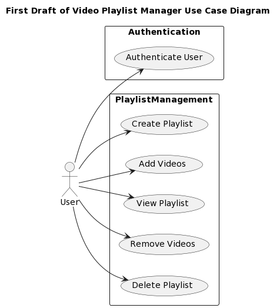
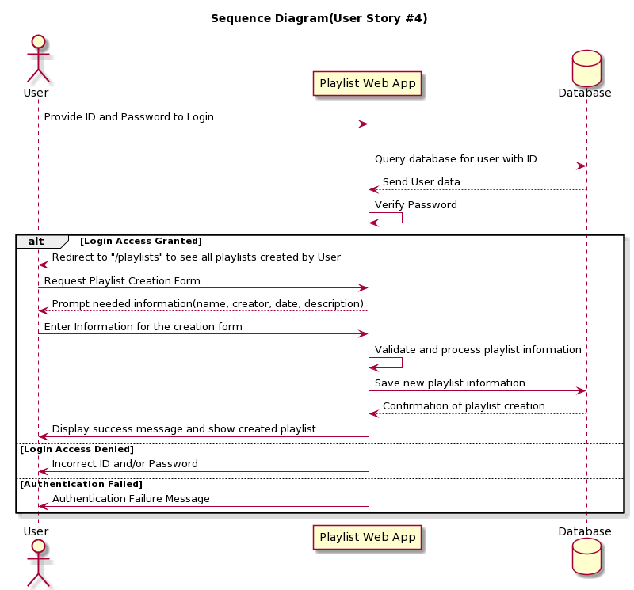
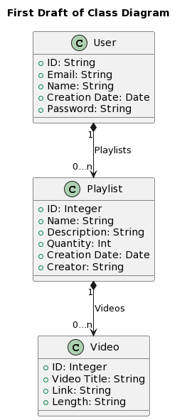

# Project 3

## Overview

Project 3 is a web application designed to provide users with a platform for accessing and managing playlists for music videos. Users can sign up, sign in, and create personalized playlists. The project utilizes bcrypt for user authorization and incorporates familiar methods used throughout the semester.

The deadline for this project is December 7, 2023. The development framework follows the Scrum methodology, with sprints and regular reports conducted over Microsoft Teams. The project is managed through Jira, hosting User Stories, problems, and descriptions of planned implementations.

## Design

### UML Use Case Design

### Sequence Diagram

### Class Diagram

## User Stories

### User Story 1

As a user, I want to register on the online platform so that I can create and use video playlists. Given that a user provides a unique ID, name, email, and password, when the user clicks on the "Sign Up" button their user information is saved, and a customer profile is created.

### User Story 2

As a registered user, I want to sign in to the video playlist manager web app to access and manage my personalized playlists. Upon clicking the "Sign In" button and providing valid credentials (username and password), I expect to be redirected to a dashboard displaying my existing playlists. In case of invalid credentials, an appropriate error message should be displayed.

### User Story 3

As a user of the video playlist manager web app, I want to create a new playlist so that I can organize and curate a collection of videos according to my preferences. When I am logged into my account, I should be able to navigate to the "Create Playlist" option. Upon selecting this option, I want to be prompted to enter a unique name for my playlist, description, creation date, and creator name. After submitting the required information, the system should create the playlist and allow me to start adding videos to it. This way, I can easily manage and enjoy a customized selection of videos within the platform.

### User Story 4

As a user of the video playlist manager web app, I want to enrich my playlists by adding new videos with relevant information. Given that I am logged into my account, I should be able to navigate to the desired playlist and select the "Add Video" option. Upon choosing this option, I want to be prompted to provide the necessary information for the new video, including its title, length, and link. After entering the required details, I expect the system to validate the information and add the video to the selected playlist. This way, I can seamlessly expand and personalize my playlists with videos that align with my preferences, creating a curated collection for an enhanced viewing experience.

### User Story 5

As a user of the video playlist manager web app, I want to delete a video from an existing playlist to refine and customize its content. When I am logged into my account, I should be able to navigate to the specific playlist containing the video I wish to remove. Upon selecting the playlist, I want to see a list of videos within it. I should then be able to choose the "Remove Video" option for the specific video I want to delete. After confirming my action, the system should promptly remove the selected video from the playlist, ensuring that my curated collection remains tailored to my preferences. This functionality enables me to easily manage and refine the content of my playlists within the platform.

### User Story 6

As a user of the video playlist manager web app, I want to remove an existing playlist to better organize and manage my collections. Given that I am logged into my account, I should be able to navigate to the list of my playlists and select the specific playlist I want to delete. Upon choosing the "Delete Playlist" option, I want the system to prompt me for confirmation. After confirming my intent, the system should promptly remove the selected playlist from my account. This functionality ensures that I can efficiently declutter my playlist collection and maintain a streamlined and personalized set of playlists within the platform.

## Development Process

| Sprint# | Goals               | Start      | End        | Done | Observations |
| ------- | ------------------- | ---------- | ---------- | ---- | ------------ |
| 1       | US#1 and US#2       | 11/17/2023 | 11/24/2023 | Yes  | N/A (usage from previous projects) |
| 2       | US#2 and US#3       | 11/28/2023 | 12/4/2023  | In Progress   | - |

## Testing

| Problem | Date       | Name   | Status  | Observations | Coverage |
| ------- | ---------- | ------ | ------- | ------------ | -------- |
| Sign in working | 11/28/2023 | Joseph | Working | - | N/A |
| Sign out working | 11/29/2023 | Joseph | Working | - | N/A |
| Unit Tests for Implementing User, Playlist, and Video Models | 12/2/2023 | Joseph | Working | All Unit Tests passed | 100% coverage(screenshot below)

### Deployment 

The final product must demonstrate the integrity of at least 5 of the 6 planned user stories. The final product must be packaged in the form of a docker image. In this section, describe the steps needed to generate that image so that others can deploy the product themselves. All files required for the deployment must be available, including the docker file, source/binary code, external package requirements, data files, images, etc. Instructions on how to create a container from the docker image with parameters such as port mapping, environment variables settings, etc., must be described (if needed). 
